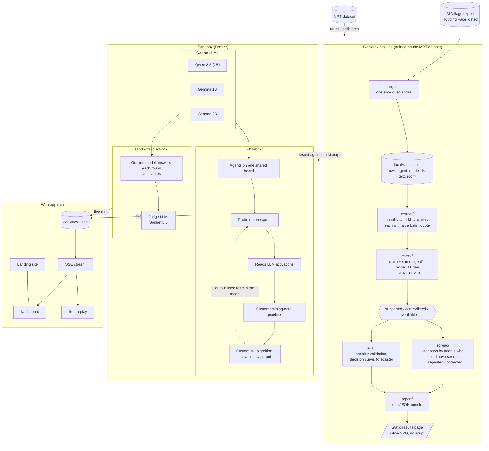

# Architecture

```mermaid
flowchart TD
    HF[("AI Village export<br/>Hugging Face, gated")]

    subgraph PIPE["Blackbox pipeline (trained on the MRT dataset)"]
        direction TB
        ING["ingest/<br/>one slice of episodes"]
        DB[("local/slice.sqlite<br/>rows: agent, model, ts, text, room")]
        EXT["extract/<br/>chunks → LLM → claims,<br/>each with a verbatim quote"]
        CHK["check/<br/>claim + same agent's record ±1 day<br/>LLM A + LLM B"]
        VERD{{"supported / contradicted / unverifiable"}}
        SPR["spread/<br/>later rows by agents who could have seen it<br/>→ repeated / corrected"]
        EVAL["eval/<br/>checker validation,<br/>decision curve, forecaster"]
        REP["report/<br/>one JSON bundle"]
        PAGE[/"Static results page<br/>inline SVG, no script"/]

        ING --> DB --> EXT --> CHK --> VERD
        VERD --> SPR
        VERD --> EVAL
        SPR --> REP
        EVAL --> REP
        REP --> PAGE
    end

    subgraph SBX["Sandbox (Docker)"]
        direction TB

        subgraph SWARM["Swarm LLMs"]
            Q["Qwen 2.5 (2B)"]
            G1["Gemma 1B"]
            G2["Gemma 2B"]
        end

        subgraph WB["whitebox/"]
            BOARD["Agents on one shared board"]
            PROBE["Probe on one agent"]
            ACT["Reads LLM activations"]
            TRAIN["Custom training-data pipeline"]
            MLALG["Custom ML algorithm:<br/>activation → output"]
            BOARD --> PROBE --> ACT --> TRAIN --> MLALG
            MLALG -. "output used to train the model" .-> PROBE
        end

        subgraph BB["sandbox/ (blackbox)"]
            OUTSIDE["Outside model answers each round<br/>and scores"]
            JUDGE["Judge LLM:<br/>Sonnet 5.5"]
            OUTSIDE --> JUDGE
        end

        SWARM --> BOARD
        SWARM --> OUTSIDE
    end

    subgraph WEB["Web app (ui/)"]
        direction TB
        LIVE[("local/live/*.jsonl")]
        SSE["SSE stream"]
        SITE["Landing site"]
        DASH["Dashboard"]
        REPLAY["Run replay"]
        LIVE --> SSE
        SSE --> DASH
        SSE --> REPLAY
        SITE --- DASH
    end

    HF --> ING
    MRT[("MRT dataset")] -. "trains / calibrates" .-> PIPE
    PIPE -. "tested against LLM output" .-> SBX
    WB -- "live runs" --> LIVE
    BB -- "live runs" --> LIVE
```
